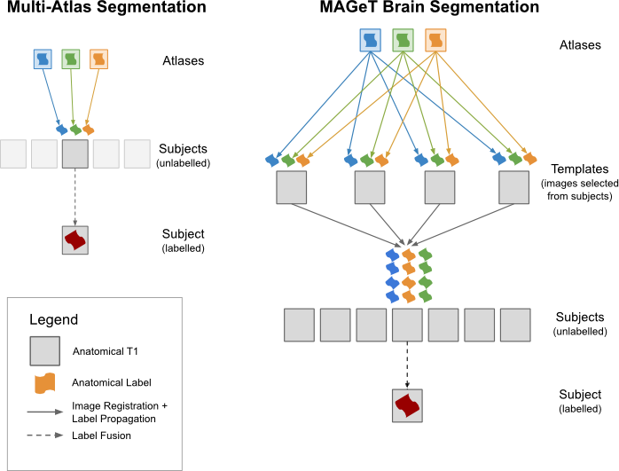

# MAGeTbrain Implementation using antsRegistration

Implementation of Multiple Automatically Generated Templates brain segmentation
algorithm [MAGeTbrain](https://github.com/CobraLab/MAGeTbrain) built upon
[antsRegistration](https://github.com/stnava/ANTs) and the
[qbatch](https://github.com/pipitone/qbatch) generic cluster submission system.



## Requirements

-   [bash](https://www.gnu.org/software/bash) version 3.0 or later

-   [python](https://www.python.org) version 2.7.x or later

-   [qbatch](https://github.com/pipitone/qbatch) version 1.1 or later

-   [ANTs](https://github.com/stnava/ANTs) with ITK_BUILD_MINC_SUPPORT or
[minc-toolkit-v2](https://bic-mni.github.io) version 1.9.11 or later

- [bc](https://www.gnu.org/software/bc/) any version (this comes standard with
most linux systems)

MAGeTbrain is very computationally expensive, performing
``atlases*templates + templates*subjects`` linear and non-linear registrations.
This produces large number of files of moderate file size. Typical subject
pools produce outputs on the scale of 100's of GB.

## Principles of MAGeTbrain

MAGeTbrain was developed to produce high-quality segmentations (labels) of
anatomical areas in structural MRI volumes. It operates by the principle of
starting with a small number of high-quality expertly segmented atlases and
transforming them onto a subject pool through an intermediate registration to a
"representative" subset of subjects called the template pool. Through
pair-wise registration from atlas-template and template-subject the number of
candidate segmentations is increased while the template pool absorbs the
large-scale methodological and structural variation of the subject pool. After
all candidates have been produced the resulting segmentations are fused via a
majority vote scheme.

## Best practices

MAGeTbrain accepts any expertly segmented MRI volume/label pairs as atlas
inputs (such as those available at <http://cobralab.ca/atlases/> for the
hippocampus, subcortical and cerebellar structures) or you may
provide your own for other structures. An odd number of atlases is strongly
recommended to avoid tie votes during the label fusion process.

Templates, which are a duplication of a subset of the subject pool should be
chosen to span the anatomical variability of the subject pool. Typical template
pool size is 21 subjects. Based on simulations of MAGeTbrain, additional
subjects beyond 21 provides minimal improvement in the final outputs. The size
of the template pool should again be an odd number to avoid voting ties.
For subject pools smaller than 21, include all subjects also in the template
pool while maintaining an odd number if need be. File names for a subject
included in both the subject and template pool should be the same so that
MAGeTbrain can skip registering identical images together.

Typical application of MAGeTbrain is to preprocess input MRI volumes prior
to starting to correct for bias fields and to crop excess non-head features.
One such recommended pipeline based on the MINC tools is available at
<https://github.com/CobraLab/minc-bpipe-library>. Subject input volumes
should be corrected but otherwise in native (or otherwise non volumetrically
deformed) space, in order to ensure label volumes provide real-world measures.
MAGeTbrain was tested and optimized on 1x1x1mm isotropic MPRAGE subject data.
It has been very successfully used on higher resolution data and on other
contrast types but may require tweaking of time/memory estimates.

## How to run antsRegistration-MAGeT on SciNet

```sh
> git clone https://github.com/CobraLab/antsRegistration-MAGeT.git
> module load gcc/5.2.0 intel/15.0.2 python/2.7.8 ANTs/git qbatch/git gnu-parallel/20150822 extras/64_6.4
> source antsRegistration-MAGeT/bin/activate
> cd /path/to/my/working/Directory
> mb.sh -- init
2016-06-21 20:46:49 UTC [     info] Creating input/atlas input/template input/subject
2016-06-21 20:46:49 UTC [     info] Cleaning up. Done
# Copy atlas/template/subject files into input directories
> mb.sh -- run
2016-06-21 14:32:53 UTC [     info] Found:
2016-06-21 14:32:53 UTC [     info]   5 atlases in input/atlas
2016-06-21 14:32:53 UTC [     info]   1 labels in input/atlas
2016-06-21 14:32:53 UTC [     info]   13 templates in input/template
2016-06-21 14:32:53 UTC [     info]   13 subjects in input/subject
2016-06-21 14:32:53 UTC [     info]   0 models in input/models
2016-06-21 14:32:53 UTC [     info] Progress:
2016-06-21 14:32:53 UTC [     info]   0 of 65 atlas-template registrations completed
2016-06-21 14:32:53 UTC [     info]   0 of 156 template-subject registrations completed
2016-06-21 14:32:53 UTC [     info]   0 of 845 resample labels completed
2016-06-21 14:32:53 UTC [     info]   0 of 13 voted labels completed
2016-06-21 14:32:53 UTC [     info] Computing Atlas to Template Registrations
36648384[].gpc-sched-ib0
...
2016-06-21 14:32:55 UTC [     info] Computing Template to Subject Registrations
36648397[].gpc-sched-ib0
...
2016-06-21 14:32:58 UTC [     info] Computing Label Resamples
36648410.gpc-sched-ib0
...
2016-06-21 14:33:03 UTC [     info] Computing Votes
36648424.gpc-sched-ib0
...
2016-06-21 14:33:07 UTC [     info] Cleaning up. Done

# For options and individual stage control, see mb.sh --help
```

## MAGeTbrain Stages

MAGeTBrain runs in a number of stages, some of which can run in parallel and
others which must run after prior stages are completed. In addition, this
pipeline describes a number of utility stages for assisting in running
MAGeTbrain. All of these stages can be run by invoking them after ``--`` in
your ``mb.sh`` call.

### Utility stages

-   ``init`` - setup the input directory structure for MAGeTbrain

-   ``status`` - display the status check counting work completed and work to
be done and exit

-   ``cleanup`` - create and submit a job to tar, compress and delete all
intermediate files, for use after a successful run

### Standard stages

-   ``template`` - register atlases to templates

-   ``subject`` - register templates to subjects

-   ``resample`` - transform candidate label files through
atlas-template-subject chain. Depends on completion of ``template`` and
``subject`` stages

-   ``vote`` - perform majority vote label fusion on candidate labels

-   ``run`` - calculate and submit all standard stages

Stages manually specified on the command line do not check if their antecedent
stages have completed successfully, this can result in undefined behavior.
If you specify stages manually, please ensure that antecedent stages are
complete.

Commands in a given stage in MAGeTbrain are deemed complete if their output
files exist, this means that if a pipeline was stopped at some point, it can
resume by examining the existing files. If input files are changed be careful
to cleanup old intermediate files.

### Multi-atlas stages

Multi-atlas mode in MAGeTbrain disables the "template" concept, resulting in
operation like a classic multi-atlas segmentation tool.
All subjects are ignored for this mode, instead templates are treated as
subjects.

-   ``multiatlas-resample`` - transform candidate label files through
atlas-template chain, treating templates as if they were subjects. Depends upon
completion of ``template`` stage

-   ``multiatlas-vote`` - perform majority vote label fusion on template
candidate labels

-   ``multiatlas`` - perform ``template``, ``multiatlas-resample`` and
``multiatlas-vote`` stages

Typical use of this mode is for verification vs MAGeTbrain mode and for manual
"best" template selection. For template selection, include all your subjects as
templates, run ``multiatlas`` mode, then QC the resulting labels. Choose the
bestquality labels from the template pool and use those subjects as your
templates. Run MAGeTbrain as normal from there.

## Complex MAGeTbrain Runs

### Resolution

MAGeTbrain was originally designed and optimized for the case of CoBrALab's
0.3 mm isotropic atlases and 1 mm isotropic template/subject whole-brain
MRIs with T1 or T2 contrasts.

This new version of MAGeTbrain will attempt to compute walltime and memory
requirements for a given input resolution based on some empirical research
<https://github.com/gdevenyi/antsRegistration-benchmarking> plus a 5% safety
factor for errors in estimates.

### Multi-spectral

MAGeTbrain now supports multi-spectral registrations (combined contrasts
from multiple MRI volumes) via the
``--reg-command mb_register_multispectral.sh`` option. This registration script
will use any combined contrasts found for both affine and non-linear
registrations with equal weighting.

Multi-spectral registrations effectively double the amount of scan data used
during registration, it is suggested that you increase the scaling factor
``--factor`` to approximately 2 to compensate.

### ROI (masked) based registrations

Using a brain or ROI mask provides a number a number of potential benefits,
improved registrations and reduction in memory requirements, although these
benefits have not been throughly examined empirically.

If the masks are supplied and the ``--reg-command mb_register_masked.sh``
option is specified, affine registrations will first be done unmasked and then
the last affine stage and non-linear stage will be done with the mask applied.
If an ROI mask is used, please ensure that your labels of interest lie within
the ROI, otherwise the non-linear registrations will never be computed for your
labels.

### Slabs

MAGeTbrain should successfully operate using slabs rather than whole brains as
inputs. It may benefit from an ROI mask defining the boundary of the slab in
order to prevent non-linear registrations from wasting cycles and avoiding
possible sharp-edge effects on the smooth registration fields.

## How to install/configure MAGeTbrain to run elsewhere

MAGeTbrain was designed and tested to run on Compute Canada's SciNet
supercomputing cluster located in Toronto, Canada. The cluster consists of
3000+ 8-CPU (16-core) compute nodes with 16 GB of RAM each. MAGeTbrain handles
job creation and submission via the ``qbatch`` job creation tool supporting
PBS, SGE and LSF(soon) clusters. ``qbatch`` is configured via a number of
environment variables, see <https://github.com/pipitone/qbatch>. ``qbatch``
will split up MAGeTbrain jobs according to its configuration to honour
walltime and memory specifications.

To run MAGeTbrain locally, install ``qbatch`` and define
``QBATCH_SYSTEM="local"``, ``qbatch`` will run commands locally using GNU
parallel. Note that MAGeTbrain running a single computer is a very slow
process. We estimate a processing time of approximately 350 hours for a 5 atlas
21 template, 1 subject run, and 60 hours per additional subject when running
on a single CPU. Processing is linearly decreased with more processors but
eventually memory limited on most desktop computers. We strongly recommend
installing MAGeTbrain on a cluster.

## Input File/Directory Structure

The following is an example data structure for a single atlas/template/subject.
The names ``atlas1``, ``template1``, and ``subject1`` are arbitrary.
``ext`` can be any image format ANTs/ITK supports, currently MINC2 (``.mnc``),
NIFTI1/2 (``.nii`` or ``.nii.gz``) and Analyze (``.hdr`` and ``.img``)

```sh
input/
    atlas/
        atlas1_t1.ext - mandatory MRI volume
        [ atlas1_[t2, pd, fa, md].ext ] - co-registered to t1
        atlas1_label_name.ext - mandatory label file, basename must match t1
        [ atlas1_label_name2.ext ] - additional labels
        [ atlas1_label_nameN.ext ] - arbitrary numbers of labels
        [ atlas1_mask.ext ] - mask used to focus registration
        ### additional atlas/label pairs as desired
    template/
        subject1_t1.ext - filename should match subject with same MRI
        [ subject1_[t2, pd, fa, md].ext ] - co-registered to t1, requires atlas to also have this contrast
        [ subject1_mask.ext ] - mask used to focus registration
        ### additional templates as desired
    subject/
        subject1_t1.ext - filename should match subject with same MRI
        [ subject1_[t2, pd, fa, md].ext ] - co-registered to t1, requires template to also have this contrast
        [ subject1_mask.ext ] - mask used to focus registration
        ### additional subjects as desired
```

## Output File/Directory Structure

The following describes the standard set of outputs for the input structure
above

```sh
output/
    transforms/
        atlas-template/
            template1_t1.ext/
                atlas1_t1.ext-template1_t1.ext0_GenericAffine.xfm - MINC format affine transform
                atlas1_t1.ext-template1_t1.ext1_NL.xfm -- MINC format nonlinear transform
                atlas1_t1.ext-template1_t1.ext1_NL_grid_0.mnc -- MINC format nonlinear grid
                ### additional atlas to template1 registrations
            ### additional directories per template
        template-subject/
            subject1_t1.ext/
                template1_t1.ext-subject1_t1.ext0_GenericAffine.xfm - MINC format affine transform
                template1_t1.ext-subject1_t1.ext1_NL.xfm - MINC format nonlinear transform
                template1_t1.ext-subject1_t1.ext1_NL_grid_0.mnc -- MINC format nonlinear grid
                ### additional template to subject1 registrations
            ### additional directories per subject
    labels/
        candidates/
            subject1_t1.ext/
                atlas1_t1.ext-template1_t1.ext-subject1_t1.ext-atlas1_label_name.ext - resampled candidate label
                ### additional candidate labels for each atlas-template-subject path
                ### additional candidate labels for each input label
        majorityvote/
            subject1_label_name.ext - final majority vote label
            ### additional labels for each input label
            ### additional labels for each subject
### Optional outputs for multiatlas mode
    multiatlas/
        labels/
            candidates/
                template1_t1/
                    atlas1_t1.ext-template1.ext-atlas1_label_name.ext - resampled candidate label
                    ### additional labels for each atlas-template path
                ### additional directories for each template
            majorityvote/
                template1_label_name.ext - final majority vote label
                ### additional labels for each template
```
